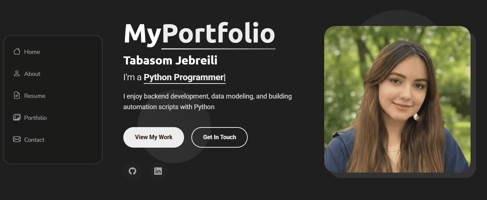

---

## 🚀 Live Demo

> Visit the live site: [https://tabasom.dev]

---

# Tabasom.dev

A personal portfolio website built with Flask and Bootstrap.

This site showcases my best programming projects (all hosted on my GitHub), along with
my background and ways to contact me. The site uses a customized Bootstrap template. 
All navigation links and project sections are dynamic and easy to update via Flask templates.

---

## ✨ Features

- Responsive, modern design with Bootstrap
- Built with Flask (Python web framework)
- Fully dynamic navigation and project listing (using base.html and Jinja templating)
- Portfolio projects auto-updated from my GitHub
- Easy to maintain and extend

## 📁 How it works

- The `base.html` template defines the site layout, navigation, and dynamic content blocks.
- All project and page links are rendered dynamically from Python/Flask code.
- Projects section fetches and displays my public GitHub repositories.

---

## 📫 Contact

Feel free to reach out via the [https://tabasom.dev/#contact] on my website  
or connect with me on [https://www.linkedin.com/in/tabasom-jebreili/].

---

**Made with Flask, Bootstrap, and a lot of love!**
